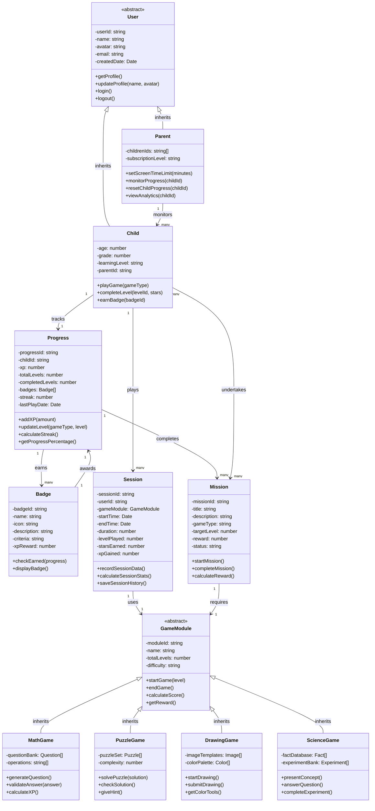

# BrainQuest Class Diagram

## 📋 Diagram Overview

The class diagram depicts the **object-oriented structure** of the BrainQuest system. Key classes include:

- **User** (with Child and Parent subclasses)
- **GameModule** (with Math, Puzzle, Drawing, and Science subclasses)
- **Badge**
- **Mission**
- **Progress**
- **Session**

Each class shows its **attributes** and **methods**, along with the relationships (**associations**, **inheritance**, and **aggregations**) between them.

---

## 🎯 Class Structure

---

## 📊 Relationship Types

### **Inheritance (--|>)**
- `Child` and `Parent` inherit from `User`
- `MathGame`, `PuzzleGame`, `DrawingGame`, and `ScienceGame` inherit from `GameModule`

### **Associations (-->)**
- `Parent` monitors multiple `Child` users
- `Child` plays multiple `Session` instances
- `Child` has one `Progress` tracker
- `Session` uses one `GameModule`
- `Progress` tracks multiple `Badge`s and `Mission`s
- `Mission` requires one `GameModule`

### **Aggregations**
- Progress aggregates Badges (child can exist without badges)
- Child aggregates Sessions (sessions depend on child)

---

## 🎮 Key Attributes & Methods

### **User Classes**
| Class | Key Attributes | Key Methods |
|-------|---|---|
| **User** | userId, name, avatar, email | getProfile(), updateProfile() |
| **Child** | age, grade, learningLevel | playGame(), completeLevel(), earnBadge() |
| **Parent** | childrenIds, subscriptionLevel | setScreenTimeLimit(), monitorProgress() |

### **Game Modules**
| Class | Key Attributes | Key Methods |
|-------|---|---|
| **MathGame** | questionBank, operations | generateQuestion(), validateAnswer() |
| **PuzzleGame** | puzzleSet, complexity | solvePuzzle(), checkSolution() |
| **DrawingGame** | imageTemplates, colorPalette | startDrawing(), submitDrawing() |
| **ScienceGame** | factDatabase, experimentBank | presentConcept(), answerQuestion() |

### **System Classes**
| Class | Key Attributes | Key Methods |
|-------|---|---|
| **Progress** | xp, completedLevels, streak, badges | addXP(), updateLevel(), calculateStreak() |
| **Session** | sessionId, duration, starsEarned | recordSessionData(), calculateSessionStats() |
| **Mission** | missionId, targetLevel, reward, status | startMission(), completeMission() |
| **Badge** | badgeId, name, criteria, xpReward | checkEarned(), displayBadge() |

---

## ✨ Design Patterns

1. **Template Method Pattern** - GameModule defines the game flow
2. **Observer Pattern** - Parent observes Child progress
3. **Strategy Pattern** - Different GameModule strategies (Math, Puzzle, etc.)
4. **Data Transfer Object** - Session encapsulates game session data
5. **Decorator Pattern** - Badge adds rewards to Progress

### 💾 **Data Models**
- Level, World, Badge, Puzzle, Question, Fact, Image

Both diagrams are saved in your project! 📁
