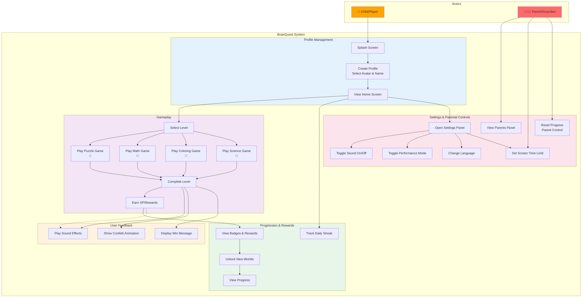

# BrainQuest Use Case Diagram

## Summary

- **Actors:** Child/Player and Parent/Guardian
- **5 Main Modules:** Profile Management, Gameplay, Progression & Rewards, Settings & Parental Controls, User Feedback
- **4 Games:** Puzzle, Math, Coloring, Science
- **Features:** XP system, badges, streak tracking, screen time limits, sound/performance toggles
